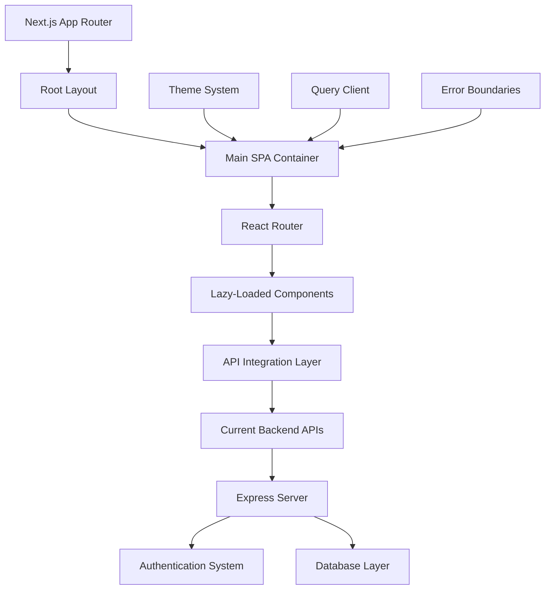

# Design Document

## Overview

This design outlines the restoration of the React-based frontend from commit `96bb1d08a4c8792634c0b229fca4a3dce03cd305` while maintaining compatibility with the current Next.js backend infrastructure. The approach involves creating a hybrid architecture where the Next.js app router serves as the foundation, but the main application logic uses React Router for client-side routing, similar to a single-page application (SPA) embedded within Next.js.

## Architecture

### High-Level Architecture



### Frontend Architecture Strategy

The design uses a "SPA-in-Next.js" approach:

1. **Next.js Layer**: Provides the foundational app structure, build system, and server-side capabilities
2. **React Router Layer**: Handles all client-side routing and navigation within the SPA
3. **Component Layer**: All the restored React components from the original frontend
4. **Integration Layer**: Adapters and utilities to bridge the original React app with the current backend

### Key Architectural Decisions

1. **Preserve React Router**: Keep the original React Router setup for maximum compatibility
2. **Hybrid Routing**: Use Next.js for the container and React Router for internal navigation
3. **Component Compatibility**: Maintain all original component interfaces and props
4. **Backend Integration**: Adapt API calls to work with current backend endpoints
5. **State Management**: Preserve React Query setup for server state management

## Components and Interfaces

### Core Application Structure

#### App Container (`app/page.tsx`)
- Serves as the Next.js entry point
- Renders the main SPA container
- Provides all necessary providers (Theme, Query Client, etc.)

#### Main SPA Component (`components/App.tsx`)
- Restored from original `client/src/App.tsx`
- Contains all React Router setup
- Manages global application state and providers

#### Router Configuration
```typescript
interface RouteConfig {
  path: string;
  component: React.LazyExoticComponent<React.ComponentType<any>>;
  requiresAuth?: boolean;
  adminOnly?: boolean;
}

const routes: RouteConfig[] = [
  { path: '/', component: Home },
  { path: '/upload', component: Upload, requiresAuth: true },
  { path: '/admin', component: AdminDashboard, adminOnly: true },
  // ... other routes
];
```

### Component Categories

#### 1. Layout Components
- **Header**: Navigation, authentication, user menu
- **Footer**: Site links, legal information
- **Layout Wrapper**: Main application container

#### 2. Page Components (Lazy Loaded)
- **Home**: Landing page with hero section
- **Upload**: Document upload and analysis
- **Trust**: Trust center
- **AdminDashboard**: Administrative interface
- **Blog**: Blog listing and individual posts
- **Subscription**: Subscription management
- **Settings**: User settings and preferences
- **Privacy/Terms/Cookies**: Legal pages

#### 3. Feature Components
- **LoginForm**: User authentication
- **SubscriptionLogin**: Subscription-based login
- **SecurityQuestionsModal**: Security verification
- **CombinedConsent**: Cookie and privacy consent
- **AnalysisResults**: Document analysis display

#### 4. UI Components
- Preserved shadcn/ui components
- Custom UI components from original app
- Accessibility-focused components

### Component Migration Strategy

#### Original Component Structure
```
client/src/components/
├── ui/                 # shadcn/ui components
├── Header.tsx         # Main navigation
├── Footer.tsx         # Site footer
├── LoginForm.tsx      # Authentication
├── AdminDashboard.tsx # Admin interface
└── ...               # Other components
```

#### Target Structure
```
components/
├── ui/                # Existing shadcn/ui components
├── restored/          # Restored components from original
│   ├── App.tsx       # Main SPA component
│   ├── Header.tsx    # Restored header
│   ├── Footer.tsx    # Restored footer
│   └── ...          # Other restored components
├── adapters/         # Integration adapters
└── providers/        # Context providers
```

## Data Models

### Authentication State
```typescript
interface AuthState {
  isLoggedIn: boolean;
  user: User | null;
  isAdmin: boolean;
  isCheckingAuth: boolean;
  subscriptionTier: string;
}

interface User {
  id: string;
  email: string;
  tier: string;
  isAdmin: boolean;
}
```

### Application State
```typescript
interface AppState {
  theme: 'light' | 'dark' | 'system';
  isMobileMenuOpen: boolean;
  showConsentModal: boolean;
  showSecurityQuestionsModal: boolean;
}
```

### API Integration Models
```typescript
interface APIResponse<T> {
  success: boolean;
  data?: T;
  error?: string;
  message?: string;
}

interface AuthFetchOptions extends RequestInit {
  requiresAuth?: boolean;
  adminOnly?: boolean;
}
```

## Error Handling

### Error Boundary Strategy
1. **Global Error Boundary**: Catches all unhandled errors
2. **Route Error Boundaries**: Specific error handling for each route
3. **Component Error Boundaries**: Granular error handling for complex components

### Error Types
```typescript
interface AppError {
  type: 'auth' | 'network' | 'validation' | 'server' | 'unknown';
  message: string;
  code?: string;
  details?: any;
}
```

### Error Recovery
- Automatic retry for network errors
- Fallback UI for component errors
- User-friendly error messages
- Error reporting to backend

## Testing Strategy

### Component Testing
- Unit tests for all restored components
- Integration tests for component interactions
- Accessibility tests using @axe-core/react

### Route Testing
- Navigation flow testing
- Authentication flow testing
- Protected route access testing

### API Integration Testing
- Mock API responses for development
- Integration tests with actual backend
- Error scenario testing

### Performance Testing
- Lazy loading verification
- Bundle size analysis
- Runtime performance monitoring

## Migration Plan

### Phase 1: Foundation Setup
1. Create the main SPA container component
2. Set up React Router within Next.js
3. Implement basic layout structure
4. Establish provider hierarchy

### Phase 2: Core Components
1. Restore Header and Footer components
2. Implement authentication integration
3. Set up theme system compatibility
4. Create error boundaries

### Phase 3: Page Components
1. Restore all page components with lazy loading
2. Implement route protection
3. Set up navigation and transitions
4. Test all routes and navigation flows

### Phase 4: Feature Integration
1. Integrate with current backend APIs
2. Implement security features
3. Set up consent and privacy features
4. Test admin functionality

### Phase 5: Polish and Optimization
1. Performance optimization
2. Accessibility improvements
3. Mobile responsiveness verification
4. Cross-browser testing

## Integration Points

### Backend API Integration
- Preserve existing API endpoints
- Adapt authentication headers and tokens
- Maintain CSRF protection
- Handle rate limiting

### Authentication Integration
- Use current JOSE token system
- Maintain session management
- Preserve admin access controls
- Support development auto-login

### Database Integration
- No changes to current database schema
- Maintain existing data models
- Preserve subscription system
- Keep security question functionality

## Performance Considerations

### Code Splitting
- Lazy load all route components
- Split vendor bundles appropriately
- Implement progressive loading

### Caching Strategy
- React Query for server state caching
- Browser caching for static assets
- Service worker for offline functionality

### Bundle Optimization
- Tree shaking for unused code
- Dynamic imports for large dependencies
- Optimize asset loading

## Security Considerations

### Authentication Security
- Maintain current token validation
- Preserve CSRF protection
- Keep rate limiting in place
- Maintain admin access controls

### Content Security
- Sanitize user inputs
- Validate API responses
- Implement proper error handling
- Maintain privacy controls

### Development Security
- Secure development auto-login
- Environment-specific configurations
- Proper secret management
- Security audit compliance